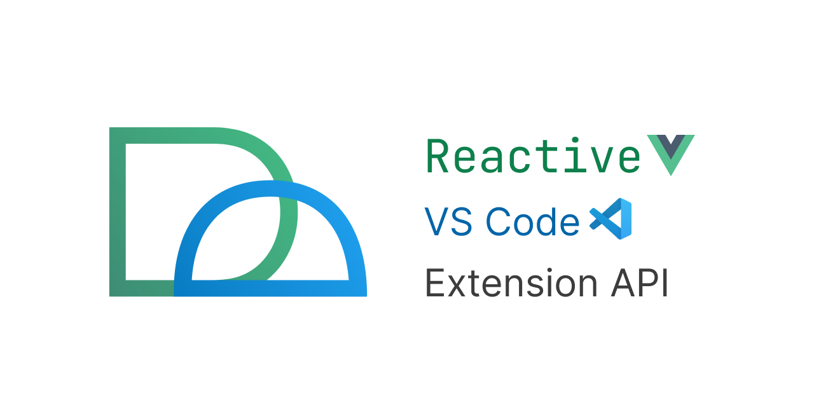

# reactive-vscode

[![npm version][npm-version-src]][npm-version-href]
[![npm downloads][npm-downloads-src]][npm-downloads-href]
[![License][license-src]][license-href]



**Develop VSCode extension with Vue Reactivity API**

- [**Documentation**](https://kermanx.github.io/reactive-vscode/)
- [**Why reactive-vscode**](https://kermanx.github.io/reactive-vscode/guide/why)
- [**All Functions**](https://kermanx.github.io/reactive-vscode/functions/)
- [**Examples**](https://kermanx.github.io/reactive-vscode/examples/)

### Project Status

Currently, most of the VSCode APIs are covered, and this project has been used in:

- [Vue - Official <sub><sub></sub></sub>](https://github.com/vuejs/language-tools)
- [Slidev for VSCode <sub><sub></sub></sub>](https://github.com/slidevjs/slidev/tree/main/packages/vscode)
- [Iconify IntelliSense <sub><sub></sub></sub>](https://github.com/antfu/vscode-iconify)

The [documentation](https://kermanx.github.io/reactive-vscode/) is complete, and the [VueUse integration](https://kermanx.github.io/reactive-vscode/guide/vueuse.html) is also available.

However, the project is still in its 0.x and may have minor API changes. If you encounter any problems, please feel free to [open an issue](https://github.com/KermanX/reactive-vscode/issues/new).

### Counter Example

```ts
import { defineExtension, ref, useCommands, useStatusBarItem } from 'reactive-vscode'
import { StatusBarAlignment } from 'vscode'

export = defineExtension(() => {
  const counter = ref(0)

  useStatusBarItem({
    alignment: StatusBarAlignment.Right,
    priority: 100,
    text: () => `$(megaphone) Hello*${counter.value}`,
  })

  useCommands({
    'extension.sayHello': () => counter.value++,
    'extension.sayGoodbye': () => counter.value--,
  })
})
```

<details>
<summary> Implementation with original VSCode API </summary>

```ts
import type { ExtensionContext } from 'vscode'
import { commands, StatusBarAlignment, window } from 'vscode'

export function activate(extensionContext: ExtensionContext) {
  let counter = 0

  const item = window.createStatusBarItem(StatusBarAlignment.Right, 100)

  function updateStatusBar() {
    item.text = `$(megaphone) Hello*${counter}`
    item.show()
  }

  updateStatusBar()

  extensionContext.subscriptions.push(
    commands.registerCommand('extension.sayHello', () => {
      counter++
      updateStatusBar()
    }),
    commands.registerCommand('extension.sayGoodbye', () => {
      counter--
      updateStatusBar()
    }),
  )
}
```

</details>

[More examples](https://kermanx.github.io/reactive-vscode/examples/).

### License

[MIT](./LICENSE) License © 2024-PRESENT [_Kerman](https://github.com/KermanX)

Source code in [the `./packages/reactivity` directory](https://github.com/KermanX/reactive-vscode/blob/main/packages/reactivity) is ported from [`@vue/runtime-core`](https://github.com/vuejs/core/blob/main/packages/runtime-core). Licensed under a [MIT License](https://github.com/vueuse/vueuse/blob/main/LICENSE).

Source code in [the `./packages/mock` directory](https://github.com/KermanX/reactive-vscode/blob/main/packages/core/src/mock) references the implementation of [`VSCode`](https://github.com/microsoft/vscode). Licensed under a [MIT License](https://github.com/microsoft/vscode/blob/main/LICENSE.txt).

The logo  is modified from [Vue Reactivity Artworks](https://github.com/vue-reactivity/art). Licensed under a [Creative Commons Attribution-NonCommercial-ShareAlike 4.0 International License](https://creativecommons.org/licenses/by-nc-sa/4.0/).

Part of the docs website is ported from [VueUse](https://github.com/vueuse/vueuse). Licensed under a [MIT License](https://github.com/vueuse/vueuse/blob/main/LICENSE).

<!-- Badges -->

[npm-version-src]: https://img.shields.io/npm/v/reactive-vscode?style=flat&colorA=080f12&colorB=1fa669
[npm-version-href]: https://npmjs.com/package/reactive-vscode
[npm-downloads-src]: https://img.shields.io/npm/dm/reactive-vscode?style=flat&colorA=080f12&colorB=1fa669
[npm-downloads-href]: https://npmjs.com/package/reactive-vscode
[bundle-src]: https://img.shields.io/bundlephobia/minzip/reactive-vscode?style=flat&colorA=080f12&colorB=1fa669&label=minzip
[bundle-href]: https://bundlephobia.com/result?p=reactive-vscode
[license-src]: https://img.shields.io/github/license/KermanX/reactive-vscode.svg?style=flat&colorA=080f12&colorB=1fa669
[license-href]: https://github.com/KermanX/reactive-vscode/blob/main/LICENSE
[jsdocs-src]: https://img.shields.io/badge/jsdocs-reference-080f12?style=flat&colorA=080f12&colorB=1fa669
[jsdocs-href]: https://www.jsdocs.io/package/reactive-vscode
